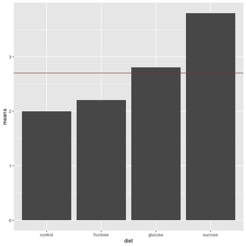

One-Way ANOVA II
========================================================
author: Prof Randi Garcia
date: September 9, 2021
autosize: true
transition: linear
transition-speed: default
font-family: 'Helvetica'

<style>
.small-code pre code {
  font-size: 1em;
}
</style>

Announcements
========================================================

- HW1b and HW1c due tomorrow at 11:55p
    - Any questions?
- In-person Office hours (Bass 412)
    - Thurs (today) 1:20-2:35p
- Zoom Office hours
    - Full for this week!
- Where to get HW help

The Meats 
=======================================================
One-Way Randomized Design

The shelf life of meats is the time a prepackaged cut remains salable, safe, and nutritious. Recent studies suggested controlled gas atmospheres as possible alternatives to existing packaging. To test this, beef steaks (75$g$) were randomly assigned to packaging with either 1) ambient air in a  commercial plastic wrap, 2) vacuum packed, 3) 100% carbon dioxide ($CO_2$), or 4) a mixture of 1% carbon monoxide (CO), 40% oxygen ($O_2$), and 59% nitrogen (N). The number of psychrotrophic bacteria on the meat was measured after nine days of storage at 4 degrees C.

Gender Bias in STEM
=======================================================
One-Way Randomized Design 

In a randomized double-blind study (n = 127), science faculty from research-intensive universities rated the application materials of a student who was randomly assigned either a male or female name for a laboratory manager position. Faculty participants rated the male applicant as significantly more hireable than the (identical) female applicant. [See materials here](http://www.pnas.org/content/suppl/2012/09/16/1211286109.DCSupplemental/pnas.201211286SI.pdf#nameddest=STXT)

Acid Rain   
=======================================================
One-Way Randomized Design

"Clean" precipitation has a pH in the 5.0 to 5.5 range, but observed precipitation pH in northern New Hampshire is often in the 3.0 to 4.0 range. Is this acid rain hurting trees? 240 six-week-old yellow birch seedlings were randomly assigned to one of 5 groups. Each group received an acid rain mist at the following pH levels: 4.7, 4.0, 3.3, 3.0, and 2.3. After 17 weeks, the seedling were weighed, and their total plant (dry) weight was recorded. 

Assembly Line Metaphor (Cobb, 2008)
========================================================

- Instead of the CAT scan metaphor used in your Stat2 book, I like the assembly line metaphor from the Cobb book.


***


[Remembering George Cobb](https://magazine.amstat.org/blog/2020/07/01/remembering-george-cobb-1947-2020/)


Simulation in R: Assembly Line Metaphor
=======================================================
- [Assembly Line Metaphor code](https://randilgarcia.github.io/sds290fall21//lectures/03_informal_anova.Rmd).

Leafhopper survival
=======================================================
One-Way Design

It is reasonable to assume that the structure of a sugar molecule has something to do with its food value.
An experiment was conducted to compare the effects of four sugar diets on the survival of leafhoppers. The four diets were glucose and fructose (6-carbon atoms), sucrose (12-carbon), and a control (2% agar). The experimenter prepared two dishes with each diet, divided the leafhoppers into eight groups of equal size, and then randomly assigned them to dishes. Then she counted the number of days until half the insects had died in each group.

Decomposing the data
=======================================================

| control| sucrose| glucose| fructose|
|-------:|-------:|-------:|--------:|
|     2.3|     3.6|     2.9|      2.1|
|     1.7|     4.0|     2.7|      2.3|

- Let's draw a factor diagram, including a place for the grand mean and residuals.

Leafhoppers
=======================================================

Bar graph of treatment condition averages. 



***

- We'll now start thinking about if those differences in treatment effects are real, or could possibly be due to chance error. 
- To the factor diagram, let's add in the grand mean, the effects for diet, and the residuals

|X.    | control| sucrose| glucose| fructose|
|:-----|-------:|-------:|-------:|--------:|
|      |     2.3|     3.6|     2.9|      2.1|
|      |     1.7|     4.0|     2.7|      2.3|
|means |     2.0|     3.8|     2.8|      2.2|

Analysis of Variance ANOVA
=======================================================
Formal ANOVA starts with the simple idea that we can compare our estimate of **treatment effect variability** to our estimate of **chance error variability** to measure how large our treatment effect is. 

$$Variability in treatment effects = True Effect Differences + Error$$

Variability in residuals = Error

Variability in treatment effects/Variability in residuals

- If our null hypothesis is, ${H}_{0}$: True Effect Differences $=0$, then what would we expect the following ratio to equal?


Sum of Squares (SS)
=======================================================
ANOVA measures variability in treatment effects with the sum of squares (SS) divided by the number of units of unique information (df). For the BF[1] design,

$${SS}_{Treatments} = n\sum_{i=1}^{a}(\bar{y}_{i.}-\bar{y}_{..})^{2}$$

$${SS}_{E} = \sum_{i=1}^{a}\sum_{j=1}^{n}({y}_{ij}-\bar{y}_{i.})^{2}$$

$${SS}_{Total} = {SS}_{Treatments} + {SS}_{E}$$

where $n$ is the group size, and $a$ is the number of treatments.

Degrees of Freedom (df)
=======================================================
The df for a table equals the number of free numbers, the number of slots in the table you can fill in before the pattern of repetitions and adding to zero tell you what the remaining numbers have to be. 

$${df}_{Treatments}=a-1$$

$${df}_{E}=N-a$$

Mean Squares (MS)
=======================================================
The ultimate statistic we want to calculate is Variability in treatment effects/Variability in residuals.

**Variability in treatment effects**:
$${MS}_{Treatments}=\frac{{SS}_{Treatments}}{{df}_{Treatments}}$$

**Variability in residuals**
$${MS}_{E}=\frac{{SS}_{E}}{{df}_{E}}$$


F-ratios and the F-distribution
=======================================================
The ratio of these two MS's is called the F ratio. The following quantity is our test statistic for the null hypothesis that there are no treatment effects.

$$F = \frac{{MS}_{Treatments}}{{MS}_{E}}$$

If the null hypothesis is true, then F is a random variable $\sim F({df}_{Treatments}, {df}_{E})$. The [F-distribution](https://en.wikipedia.org/wiki/F-distribution).


```r
qplot(x = rf(500, 3, 4), geom = "density")
```


<!-- Six Fisher Assumptions -->
<!-- ======================================================= -->
<!-- type: section -->

<!-- Six Fisher Assumptions -->
<!-- ======================================================= -->
<!--  -->

<!-- *** -->

<!-- - C. Constant effects -->
<!-- - A. Additive effects -->
<!-- - S. Same standard deviations -->
<!-- - I. Independent residuals -->
<!-- - N. Normally distributed residuals -->
<!-- - Z. Zero mean residuals -->

<!-- C. Constant effects -->
<!-- ======================================================= -->

<!-- We assume every observation in a similar condition is affected exactly the same. (Gets the same true score).   -->

<!-- ```{r, eval=FALSE} -->
<!-- animals_sim <- animals %>% -->
<!--   mutate(benchmark = mean(calm)) %>% -->
<!--   group_by(animal) %>% -->
<!--   mutate(animal_mean = mean(calm), -->
<!--          aminal_effect = animal_mean - benchmark) -->
<!-- ``` -->

<!-- A. Additive effects -->
<!-- ======================================================= -->

<!-- We add the effects as we go down the assembly line.  -->

<!-- The interaction effect captures the possibility that conditions have non-additive effects, but it is also added to everythign else.  -->

<!-- ```{r, eval=FALSE} -->
<!-- calm_sim = benchmark  -->
<!--          + aminal_effect  -->
<!--          + cue_effect  -->
<!--          + interaction_effect  -->
<!--          + student_effect  -->
<!-- ``` -->

<!-- S. Same standard deviations -->
<!-- ======================================================= -->

<!-- The peice of code for adding error is not dependent on which condition the observations is in. -->

<!-- ```{r, eval=FALSE} -->
<!--  + rnorm(64, 0, 0.65) -->
<!-- ``` -->

<!-- I. Independent residuals -->
<!-- ======================================================= -->

<!-- Takes 64 independent draws from a normal distribution. -->

<!-- ```{r, eval=FALSE} -->
<!--  + rnorm(64, 0, 0.65) -->
<!-- ``` -->

<!-- N. Normally distributed residuals -->
<!-- ======================================================= -->

<!-- It's `rnorm()`, and not `rbinom()` or `rpois()`... -->

<!-- ```{r, eval=FALSE} -->
<!--  + rnorm(64, 0, 0.65) -->
<!-- ``` -->

<!-- Z. Zero mean residuals -->
<!-- ======================================================= -->

<!-- The second argument is the mean. -->

<!-- ```{r, eval=FALSE} -->
<!--  + rnorm(64, 0, 0.65) -->
<!-- ``` -->
