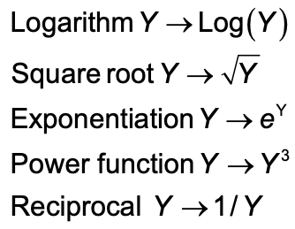

```{r setup, include=FALSE}
knitr::opts_chunk$set(message = FALSE, warning = FALSE)
```


## Announcements

- Grades are posted for HW2
    - Solution sheet will be available on Moodle on Wed
- HW3 posted    
- In-person Office hours (Bass 412)
    - Wed 10:50-12:05p (Zoom this week!)
    - Thurs 1:20-2:35p
    - or by appointment
- Zoom Office hours are full
- Where to get HW help
    - [Spinelli center](https://www.smith.edu/qlc/tutoring.html) tutoring Sun-Thurs 7-9p, Sabin-Reed 301.

## Agenda

- Transformations
- Confidence intervals
- Effect sizes
- MP1 introduction
    - topics time

## Last time

### How to check assumptions

- C. **Constant effects** -- *think* about whether it is reasonable.

- A. **Additive effects** -- *think* about whether it is reasonable.

- S. **Same standard deviations** -- is the biggest SD less than two times as large as the smallest?

- I. **Independent residuals** -- *think* about whether it is reasonable.

- N. **Normally distributed residuals** -- construct a histogram or normal probability plot of residuals.

- Z. **Zero mean residuals** -- construct a histogram or normal probability plot of residuals.

## Transformations: Example

```{r, message=FALSE, warning=FALSE}
library(Stat2Data)
library(tidyverse)
data("Diamonds")

qplot(x = Color, y = TotalPrice, data = Diamonds, geom = "boxplot")
```

## Transformations: Example

```{r}
Diamonds %>%
  group_by(Color) %>%
  summarise(n = n(),
            m = mean(TotalPrice, na.rm = TRUE),
            sd = sd(TotalPrice, na.rm = TRUE))

10937/736 #Yikes!
```

## Transformations: Example

```{r}
qplot(x = Color, y = log(TotalPrice), data = Diamonds, geom = "boxplot")
```

## Common transformations

For the response (Y)...



## How to transform

We can do the transformation directly in the visualization code:

```{r, eval=FALSE}
qplot(x = Color, y = log(TotalPrice), data = Diamonds, geom = "boxplot")
```

OR, we can create a new variable in the dataset

```{r, eval=FALSE}
Diamonds <- Diamonds %>%
  mutate(ln_TotalPrice = log(TotalPrice))

#Then, we use the new variable to make our visualization
qplot(x = Color, y = ln_TotalPrice, data = Diamonds, geom = "boxplot")
```

## When to use log transformation:

Look for:

- Distribution of response is skewed towards high end.
- The responses in one group (or more) range over two or more orders of magnitude.
- Variability varies across groups considerably, especially when the spread tracks with the mean.

## Diagnostic plot to pick a transformation

Steps:

1. Save the means and sd's of groups in a little **dataset**.
2. Make a scatterplot of log(sd) versus log(m) with a **line of best fit**.
3. Your transformation will be the response raised to the **power of 1-slope** of that line.

## Diagnostic plot to pick a transformation: Step 1

Save the means and sd's of groups in a little **dataset**.

```{r}
ds <- Diamonds %>%
  group_by(Color) %>%
  summarise(n = n(),
            m = mean(TotalPrice),
            sd = sd(TotalPrice))
```

## Diagnostic plot to pick a transformation: Step 2

Make a scatterplot of log(sd) versus log(m) with a **line of best fit**.

```{r}
qplot(x = log(m), y = log(sd), data = ds) +
  geom_smooth(method = lm, se = 0)
```

## Diagnostic plot to pick a transformation: Step 3

Your transformation will be the response raised to the **power of 1-slope** of that line.

```{r}
lm(log(sd) ~ log(m), data = ds)
```

## Diagnostic plot to pick a transformation: Step 3

```{r}
p = 1 - 1.480

qplot(x = Color, y = TotalPrice^p, data = Diamonds, geom = "boxplot")
```

## Try it for the Hawks (from HW2)! 

```{r}
library(Stat2Data)
data("Hawks")
```

- Find a transformation that helps the heterogeneity of variance for Y = Weight and X = Species.
- Run the ANOVA (even if the issue is not completely fixed) and write a sentence interpretation of your ANOVA results. 

Steps for finding a transformation:

1. Save the means and sd's of groups in a little **dataset**.
2. Make a scatterplot of log(sd) versus log(m) with a **line of best fit**.
3. Your transformation will be the response raised to the **power of 1-slope** of that line.

## ANOVA for Diamonds

```{r}
modDia <- lm(log(TotalPrice) ~ Color, data = Diamonds)
anova(modDia)
```

There are statistically significant differences in log price of diamonds across colors $F(6, 344) = 7.37$, $p < .001$. 

But what else do we want to know??

## Effect Sizes and Confidence Intervals

- The p-value for our F-ratio only tells us if effects are **detectable**.
    - Answers the question: **IS there an effect?** 
- Practical significance is different from **statistical** significance.
    - Need to answer the question: **How big is IT**? 
- Which values in ANOVA do we want to construct confidence intervals for (or calculate an effect size for)? 

### Some options:

  - A specific group mean. 
  - How far away a specific condition is from the grand average (the treatment effect).
  - How far away a specific condition is from another condition. 
  - How far away a specific condition (or set of conditions) is(are) from a(nother) set of conditions.
  - Additional effect size option: The overall variance explained by a factor of interest.

## Effect Sizes and Confidence Intervals

- The p-value for our F-ratio only tells us if effects are **detectable**.
    - Answers the question: **IS** there an effect? 
- Practical significance is different from **statistical** significance.
    - Need to answer the question: How big is **IT**? 
- Which values in ANOVA do we want to construct confidence intervals for (or calculate an effect size for)? 

Some options:

  - A specific group mean. 
  - How far away a specific condition is from the grand average (the treatment effect).
  - **How far away a specific condition is from another condition.** 
  - How far away a specific condition (or set of conditions) is(are) from a(nother) set of conditions.
  - Additional effect size option: The overall variance explained by a factor of interest.

## Confidence Intervals for Difference Between two Groups 

$$(\bar{y_i}-\bar{y_j}) \pm t^*\cdot SD \sqrt{1/n_i+1/n_j}$$

- Where $SD = \sqrt{MSE}$.
- $t^*$ depends on the confidence level and df of the error. 
- $Sample\:size\:factor = \sqrt{1/n_i+1/n_j}$, the larger the sample sizes, the narrower the interval.
- $\sqrt{{MS}_{res}}*leverage$ is the standard error of the estimate.
- $t({df}_{res})$ is the t-value the dictates distance of the interval.

## Calculating CI between groups in R

$$(\bar{y_G}-\bar{y_F}) \pm t^*\cdot SD \sqrt{1/n_G+1/n_F}$$

For difference between G (near colorless) and F (colorless)

```{r}
MSE = 0.6771 #from our ANOVA source table
df_E = 344 #from our ANOVA source table
t <- qt(.975, df_E) #for 95% CI

n_g = filter(ds, Color == "G")$n #sample size for G
n_f = filter(ds, Color == "F")$n #sample size for F

mean_g <- log(filter(ds, Color == "G")$m) #mean for G
mean_f <- log(filter(ds, Color == "F")$m) #mean for F

#Confidence interval
UL <- (mean_g-mean_f) + t*sqrt(MSE)*sqrt(1/n_g+1/n_f) #upper limit
LL <- (mean_g-mean_f) - t*sqrt(MSE)*sqrt(1/n_g+1/n_f) #lower limit
```

## Calculating CI between groups in R

For difference between G (near colorless) and F (colorless)

```{r}
LL
UL
```

Sentence interpretation:

We are 95% confident that the true mean difference in (log) price between near colorless and colorless Diamonds is between -0.20 and 0.29.   

## Equivalence of Confidence Intervals and Tests

> Two group means are statistically different at the 5% (1%) level if and only if a 95% (99%) confidence interval for their diffrence does not include 0. 

## Effect Size (D)

But **how big is IT**?

We can compare the differences between groups to to the standard deviation within all groups:

$$D_{ij} = \frac{(\bar{y_i}-\bar{y_j})}{SD}$$

- Where again $SD = \sqrt{MSE}$ 

## Effect Size (D)

For difference between G (near colorless) and F (colorless)

```{r}
D = (mean_g-mean_f)/sqrt(MSE)

D
```

The difference between the price of nearly colorless diamonds and colorless diamonds is only 0.052 times the size of the typical within-group deviations in price. Such a small difference!

## R-squared for One-Way ANOVA

But how much does color matter overall?

$R^2$ is the proportion of total variation explained by the factor:

$$R^2 = \frac{SS_{treatment}}{SS_{Total}}$$

OR

$$R^2 = 1-\frac{SS_{error}}{SS_{total}}$$

## R-squared for Diamond Color

```{r}
modDia <- lm(log(TotalPrice) ~ Color, data = Diamonds)
anova(modDia)
```

```{r}
R2 = 29.946/(29.946+232.913)
R2
```

The $R^2$ value is 0.11, so about 11% of the variation in the total price of a diamonds is explained by the diamonds' colors. 

## Try it!

Use the `SandwichAnts` dataset to calculate the CI and effect size for difference between `MultiGrain` and `Rye` in number of `Ants`.

## Mini Project 1

See [Mini Project 1 instructions](https://randilgarcia.github.io/sds290fall21/mini-project-1.html)
