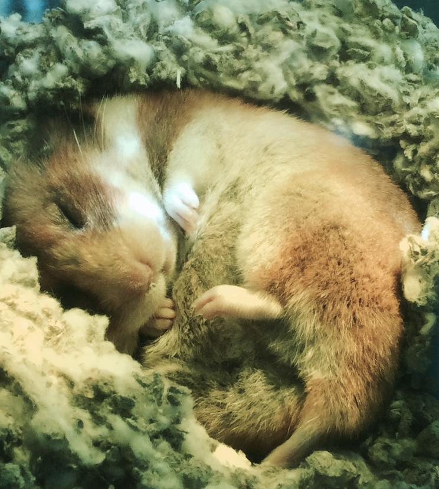

```{r setup, include=FALSE}
knitr::opts_chunk$set(message = FALSE, warning = FALSE)
```

```{r, include = FALSE}
library(Stat2Data)
library(tidyverse)
data("Diamonds")
ds <- Diamonds %>%
  group_by(Color) %>%
  summarise(n = n(),
            m = mean(TotalPrice),
            sd = sd(TotalPrice))
```

## Announcements

- Grades for HW3 posted
- HW4 due Friday 11:55p  
- Office hours **all on Zoom** this week!
    - Wed 10:50-12:05p (drop in)
    - Thurs 1:20-2:35p (drop in)
    - Friday office hours full for this week
    - or by appointment
- No class on Thursday (work on MP1)    
- Where to get HW help
    - [Spinelli center](https://www.smith.edu/qlc/tutoring.html) tutoring Sun-Thurs 7-9p, Sabin-Reed 301.
    - Post questions to #homework4-questions channel on Slack!
    - Direct message me on Slack.

## 5.59c and sampling error

>**Question:** Explain why it's not sufficient to examine the four sample means, note that they all differ, and conclude that all races do have birth weight distributions that differ from each other. 

**Answer:** Because this is just one a sample from a population. If we collected another sample we would see slightly different mean birth weights for the four groups. We need to consider if the group differences we see in this sample are greater than the differences we would expect from sample to sample.
    
## Null Hypothesis Correction

$${H}_{0}:\mu_1=\mu_2=\mu_3=\mu_4$$

*OR*, ${H}_{0}:\alpha_1=\alpha_2=\alpha_3=\alpha_4=0$

$${H}_{A}:some\:\mu_i\neq\mu_j$$

Or $H_a: Some\:\alpha_i\neq 0$. We can find the p-value for our F calculation with the following code

```{r, eval=FALSE}

pf(17.422, 3, 4, lower.tail = FALSE)
```

## Agenda

- Four designs
- Introduction to Qualtrics
- MP1 topics time

## Kelly's Hamster Study


## Kelly's Hamster Study


## Design Principal 1: Random Assignment

Design 1: One-Way Randomized Design


## Design Principal 2: Blocking

Design 2: One-Way Complete Block Design 


## Design Principal 3: Factorial Crossing

Design 3: Two-Way Factorial Design


## Kelly's Hamster Study


## Blocking + Random Assignment + Crossing

Design 4: Split Plot/Repeated Measures Design


## Introduction to Qualtrics

- Log in to [Qualtrics](smithcollege.qualtrics.com) and enter your Smith credentials.
    - I usually just Google "Smith Qualtrics"
