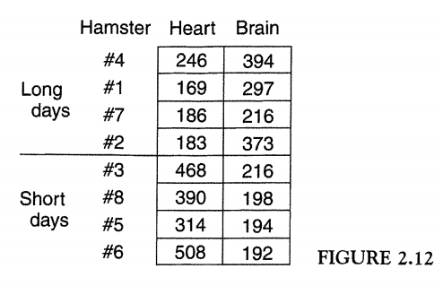

```{r global_options, include=FALSE}
knitr::opts_chunk$set(eval = FALSE)
library(dplyr)
library(ggplot2)
library(oilabs)
```

## Informal ANOVA Example

### The Yarn Breaks Data


To demonstrate informal ANOVA, we will use the yarn breaks data set, called `warpbreaks`. (To
roll with the "knitting" in R theme! Lol). Convieniently, this data is already loaded into R. It exists 
in the background. To look at it, simply run the following command. 

```{r, message = FALSE, eval=FALSE}
View(warpbreaks)
```

There are two structural factors: `wool` type (2 levels: A and B), and `tension` (3 levels: L, M, and H).
L, M, and H, correspond to "low", "medium", and "high", respectively. These two factors are crossed, 
creating 6 conditions, or cells. There are 9 looms for each of the 6 conditions, for a total of 54
looms tested. The response variable is called `breaks`. This is the number of breaks for each loom. 

You can read more about the data set using the following command:

```{r, message = FALSE, eval=FALSE}
?warpbreaks
```

What kind of design is this? A two-way basic factorial design, BF[2]. The same design you are using to MP1.

If you would like to get it into your enviroment, use the `data` function. It will first show up as
`<Promise>`, but as soon as you start using it, it will appear as a data frame. 

```{r, message = FALSE, eval=FALSE}
data(warpbreaks)
```

### Paralell Dot Graph

Paralell Dot Graphs are used to get a sense of the variability within and bewteen the six conditions. 
We will use the `ggplot2` package to make our graph.

```{r}
ggplot(warpbreaks, aes(x = tension, y = breaks, color = wool)) +
  geom_point()
```

Alternatively, you can make a side-by-side boxplot to view the within and between variability. 
Each type of visualization has its pros and cons. 

```{r}
ggplot(warpbreaks, aes(x = tension, y = breaks, color = wool)) +
  geom_boxplot()
```

As can be seen in both figures, the most breaks occur for the looms using low tension with wool type A. 
However, it also looks like there is more variability for this condition. This is a potential violation
of the Fisher assumtion of the Same standard deviations (S). Further, the largest variation goes with
the group that has the largest median. 

Let's compute some summary statistics to get a better idea of spreads for each of the six conditions. 

```{r}
 sum_stats <- warpbreaks %>%
  group_by(tension, wool) %>%
  summarise(mean = mean(breaks),
            sd = sd(breaks),
            min = min(breaks),
            max = max(breaks),
            range = max - min) %>%
  arrange(range)

 sum_stats
```

Next, we can check how many times bigger the largest spread is than the smallest spread. 
We can use the range, and standard deviation as our measures of spread with the following
two lines of code, respectively.

```{r}
sum_stats[6,7]/sum_stats[1,7]

sum_stats[6,4]/sum_stats[1,4]
```

The range is 3 times as big and the standard deviation is 3.70 times as big. 

***

## Homework 4 Problems

For homework 4, complete the following exercises. When you are done, please knit your 
homework to an HTML file and submit the HTML file on Moodle.



1. List the structural factors for the data set in Fig. 2.12 (above). No need to draw the factor diagram. 

2. Create a parallel dot graph, and a side-by-side boxplot for the data in Fig 2.12 (run the 
code provided below to get the data into R).

```{r, message = FALSE, eval=FALSE}
hamster <- rep(c(4, 1, 7, 2, 3, 8, 5, 6), 2)
day_length <- c(rep("long", 4), rep("short", 4), rep("long", 4), rep("short", 4))
organ <- c(rep("heart", 8), rep("brain", 8))
enzyme <- c(246, 169, 186, 183, 468, 390, 314, 508, 394, 297, 216, 373, 216, 198, 194, 192)

hamsters <- data.frame(hamster, day_length, organ, enzyme)
```

3. Compute the average, standard deviation (SD), and range using the same four groups as in Section 2.3 (see Table 2.2 on pg. 49)
and comment on what you find. Are the four ranges roughly equal? Are the four SD's roughly equal? Does the 
range and SD seem to be related to the average by a pattern?

4. I find it helps me remember the Fisher assumptions if I remember the nonsense word CA-SINZ, California 
SINZ. Each letter stands for an assumption: **C**onstant effects, **A**dditivity, **S**ame standard deviation, 
**I**ndependence, **N**ormality, and **Z**ero average for errors. List the four letters for assumptions about residuals.

5. Explain how the assumption of constant effects (C) is part of the justification for computing averages. 

<div id="license">
This is a product of OpenIntro that is released under a 
[Creative Commons Attribution-ShareAlike 3.0 Unported](http://creativecommons.org/licenses/by-sa/3.0). 
This lab was adapted by Randi Garcia from labs originally written by Mark Hansen, further 
adapted for OpenIntro by Andrew Bray and Mine &Ccedil;etinkaya-Rundel.
</div>

* * *

## Resources for learning R and working in RStudio

That was a short introduction to R and RStudio, but we will provide you with more
functions and a more complete sense of the language as the course progresses. 

In this course we will be using R packages called `dplyr` for data wrangling 
and `ggplot2` for data visualization. If you are googling for R code, make sure
to also include these package names in your search query. For example, instead
of googling "scatterplot in R", google "scatterplot in R with ggplot2".

These cheatsheets may come in handy throughout the semester:

- [RMarkdown cheatsheet](https://www.rstudio.com/wp-content/uploads/2016/03/rmarkdown-cheatsheet-2.0.pdf)
- [Data wrangling cheatsheet](http://www.rstudio.com/wp-content/uploads/2015/02/data-wrangling-cheatsheet.pdf)
- [Data visualization cheatsheet](http://www.rstudio.com/wp-content/uploads/2015/12/ggplot2-cheatsheet-2.0.pdf)

Note that some of the code on these cheatsheets may be too advanced for this course,
however majority of it will become useful throughout the semester.