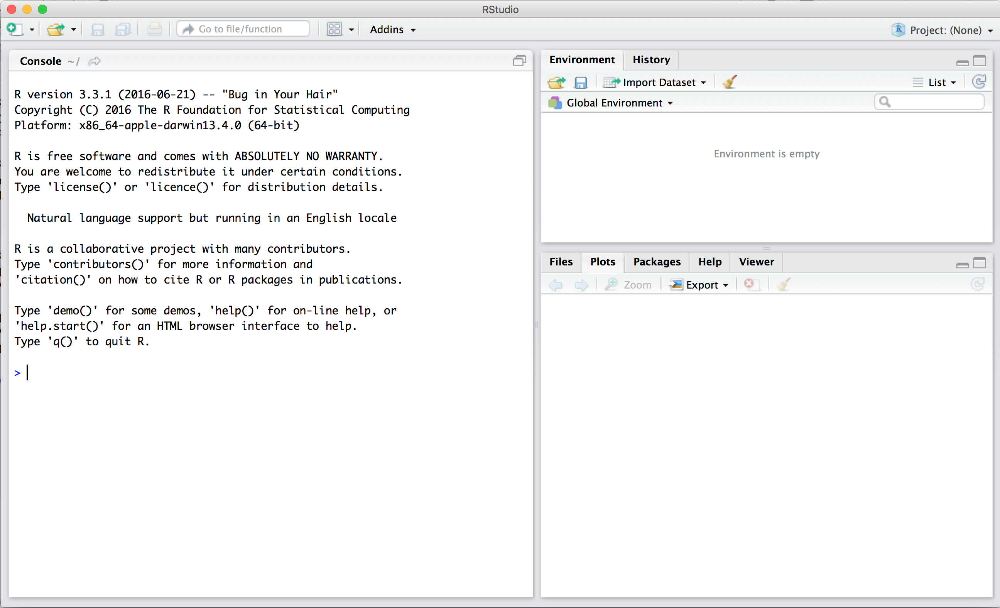

```{r global_options, include=FALSE}
knitr::opts_chunk$set(eval = FALSE)
library(tidyverse)
library(Stat2Data)
```


## The RStudio Interface

The goal of this homework is to introduce you to R and RStudio, which you'll be using
throughout the course both to learn the statistical concepts discussed in the 
course and to analyze real data and come to informed conclusions. To clarify
which is which: R is the name of the programming language itself and RStudio 
is a convenient interface.

As the homeworks progress, you are encouraged to explore the data;
a willingness to experiment will make you a much better programmer. Before we 
get to that stage, however, you need to build some basic fluency in R. Today we
begin with the fundamental building blocks of R and RStudio: the interface, 
reading in data, and basic commands.

Go ahead and launch RStudio. You should see a window that looks like the image 
shown below.


<br>


The panel on the lower left is where the action happens. It's called the *console*. 
Everytime you launch RStudio, it will have the same text at the top of the 
console telling you the version of R that you're running. Below that information
is the *prompt*. As its name suggests, this prompt is really a request: a 
request for a command. Initially, interacting with R is all about typing commands
and interpreting the output. These commands and their syntax have evolved over
decades (literally) and now provide what many users feel is a fairly natural way
to access data and organize, describe, and invoke statistical computations.

The panel in the upper right contains your *workspace* as well as a history of 
the commands that you've previously entered. 

Any plots that you generate will show up in the panel in the lower right corner. 
This is also where you can browse your files, access help, manage packages, etc.

### R Packages

R is an open-source programming language, meaning that users can contribute
packages that make our lives easier, and we can use them for free. For this lab,
and many others in the future, we will use the following R packages:

- `tidyverse`: for data wrangling and data visualization
- `Stat2Data`: for data from the Stat2 textbook

If these packages are not already available in your R environment, 
install them by typing the following lines of code into
the console of your RStudio session, pressing the enter/return key after each one. 
Note that you can check to see which packages (and which versions) are installed by
inspecting the *Packages* tab in the lower right panel of RStudio. 

```{r install-packages, message = FALSE, eval=FALSE}
install.packages("tidyverse")
install.packages("Stat2Data")
```

You may need to select a server from which to download; any of them will work.
Next, you need to load these packages in your working environment. We do this with
the `library` function. Run the following three lines in your console.

```{r load-packages, message = FALSE, eval=TRUE}
library(tidyverse)
library(Stat2Data)
```

Note that you only need to *install* packages once, but you need to *load* 
them each time you relaunch RStudio. 


### Creating a reproducible lab report

We will be using R Markdown to create reproducible lab reports. See the
following videos describing why and how:

[**Why use R Markdown for Lab Reports?**](https://youtu.be/lNWVQ2oxNho)
[**Using R Markdown for Lab Reports in RStudio**](https://youtu.be/o0h-eVABe9M)

Going forward you should refrain from typing your code directly in the console, and
instead type any code (final correct answer, or anything you're just trying out) in
the R Markdown file and run the chunk using either the Run button on the chunk 
(green sideways triangle) or by highlighting the code and clicking Run on the top 
right corner of the R Markdown editor. If at any point you need to start over, you 
can Run All Chunks above the chunk you're working in by clicking on the down
arrow in the code chunk.

## Financial incentives for weight loss

To get you started, run the following command to load the data from Chapter 0 in your textbook. 
See page 7 for more details about this study. 

```{r load-abrbuthnot-data, eval=TRUE}
data(WeightLossIncentive)
```

You can do this by

- putting your cursor on this line, and hit `Ctrl-Enter`, or
- clicking on the green arrow at the top right of the code chunk in the R Markdown (Rmd) 
file, or
- putting your cursor on this line, and hit the **Run** button on the upper right 
corner of the pane, or
- typing the code in the console.

This command instructs R to load some data: 
You should see that the 
workspace area in the upper righthand corner of the RStudio window now lists a 
data set called `WeightLossIncentive` that has 38 observations on 3 variables. As you 
interact with R, you will create a series of objects. Sometimes you load them as
we have done here, and sometimes you create them yourself as the byproduct of a 
computation or some analysis you have performed.

You can read more details about this data but using the `?` command:

```{r}
?WeightLossIncentive
```

We can view the data by 
typing its name into the console. However printing the whole dataset in the console 
is not that useful. Instead we can see the top 6 cases with the following command.
Type the following line under `data(WeightLossIncentive)` in your lab report by clicking `Enter`
after the `)`. Then run it.

```{r view-data}
head(WeightLossIncentive)
```

 
One advantage of RStudio is that it comes with a built-in data viewer. Click on
the name `WeightLossIncentive` in the *Environment* pane (upper right window) that lists 
the objects in your workspace. This will bring up an alternative display of the 
data set in the *Data Viewer* (upper left window). You can close the data viewer
by clicking on the `x` in the upper lefthand corner.

What you should see are four columns of numbers, each row representing a 
different person: the first entry in each row is simply the row number (an index 
we can use to access the data from individual people if we want), the second is 
the amount of weight loss, and the third is the experimental group to which the person 
was assigned. The fourth is the 7 month follow-up. Each case is a person in this 
dataset. Use the scrollbar on the right side of the console window to examine the complete data set.

Note that the row numbers in the first column are not part of the `WeightLossIncentive` data. 
R adds them as part of its printout to help you make visual comparisons. You can
think of them as the index that you see on the left side of a spreadsheet. In 
fact, the comparison to a spreadsheet will generally be helpful. R has stored 
the weightloss incentive data in a kind of spreadsheet or table called a *data frame*.

You can see the dimensions (number of rows, the cases, and number of columns, the variables) of this data frame as well as the names of the variables and the first few observations by typing it under `glimpse(WeightLossIncentive)` and then running it:

```{r glimpse-data}
glimpse(WeightLossIncentive)
```

This command should output the following

```{r glimpse-data-result, echo=FALSE, eval=TRUE}
glimpse(WeightLossIncentive)
```

We can see that there are 38 observations and 3 variables in this dataset. At this point, you might notice 
that many of the commands in R look a lot like functions from math class; that 
is, invoking R commands means supplying a function with some number of arguments. 
The `glimpse` command, for example, took a single argument, the name of a data frame. 

## Some Exploration

Let's start to examine the data a little more closely. We can access the data in
a single column of a data frame separately using a command like

```{r view-boys}
WeightLossIncentive$WeightLoss
```

This command will only show the amount of weight the participants lost during the study. The dollar
sign basically says "go to the data frame that comes before me, and find the 
variable that comes after me". Type your code to answer the following question
in the chunk (gray part) under `### Exercise 1:` in your homework. Type your
answer to any interpretation questions in the white part under the exercise chunk.

1. What command would you use to extract just the groups that participants were assigned to? Try
    it! 
    
Notice that the way R has printed these data is different. When we looked at the
complete data frame, we saw 38 rows, one on each line of the display. These data
are no longer structured in a table with other variables, so they are displayed 
one right after another. Objects that print out in this way are called *vectors*; 
they represent a set of numbers. R has added numbers in [brackets] along the left
side of the printout to indicate locations within the vector. For example, 8.0 
follows [22], indicating that 8.0 is the twenty-second entry in the vector. And if [43] 
starts a line, then that would mean the first number on that line would represent
the 43rd entry in the vector.


### Data visualization

R has some powerful functions for making graphics. We can create a simple plot 
of the amount of weight lost by participants with the command

```{r plot-girls-vs-year}
#try typing this directly into the console and pressing enter
qplot(x = WeightLoss, data = WeightLossIncentive, bins = 10)
```

The `qplot()` function (meaning "quick plot") considers the type of data you have
provided it and makes the decision to visualize it with a histogram. The plot
should appear under the code chunk. Notice 
that the command above again looks like a function, this time with three arguments
separated by commas. The first two arguments in the `qplot()` function specify 
the variable for the x-axis and the name of the
data set where they can be found. The third specifies the number of bins for the 
histogram. Try changing the number of bins (e.g., 12 bins, 3 bins, 27 bins). 

```{r plot-girls-vs-year-line}
#type this into the chunk under Exercise 2
qplot(x = WeightLoss, data = WeightLossIncentive, bins = 10)
```

2. Does the distribution of weight lost appear normal (i.e., approximately bell-shaped)? 
How would you describe it (in terms of modality and skew, for example)? (To ensure that your 
homework is comprehensive, be sure to include the code needed to make the plot as well as your written
interpretation.)

Thankfully, R documents all of its functions extensively. To 
read what a function does and learn the arguments that are available to you, 
just type in a question mark followed by the name of the function that you're 
interested in. Try the following.

```{r plot-help, tidy = FALSE}
#type into the console
?qplot
```

Notice that the help file replaces the plot in the lower right panel. You can 
toggle between plots and help files using the tabs at the top of that panel.

### Summary Statistics

Now, suppose we want to calculate the sample size, average weight loss, and standard deviation of 
weight loss for the two groups (incentive and control). We can use the `filter()`, `group_by()` 
and `summarize()` functions.

```{r calc-total-bapt-vars-save}
# Start recording in your exercise 3 chunk from here
WeightLossIncentive %>%
  filter(!is.na(WeightLoss)) %>%
  group_by(Group) %>%
  summarize(group_n = n(),
            group_mean = mean(WeightLoss),
            group_sd = sd(WeightLoss))
```

The `%>%` operator is called the **piping** 
operator. It takes the output of the previous expression and pipes it into 
the first argument of the function in the following one. 
To continue our analogy with mathematical functions, `x %>% f(y)` is 
equivalent to `f(x, y)`.

<div id="boxedtext">
**A note on piping: ** Note that we can read these three lines of code as the following: 

"Take the `WeightLossIncentive` dataset and **pipe** it into the `filter` function. Only keep 
those cases where the `WeightLoss` variable is not (`!`) missing (`is.na()`). We do this to keep our 
code simple later on. More on working with missing data later on in the semester. The we pipe this complete data 
into the `group_by` function. Group the `WeightLossIncentive` data set by `Group` then **pipe** that grouped dataset 
into the `summarize` function. Summarize that grouped dataset by calculating the sample size (`n() function`) 
a mean (`mean()` function) and 
a standard deviation (`sd()` function) for each group. Note that the `n()` function is just empty. This might 
look weird, but it's what we want! 

</div>

We can also make a side-by-side boxplot to visualize the weight loss by group. Again 
we'll use the `qplot` function, but this time the variable `Group` will be on the 
x-axis and the variable `WeightLoss` will be on the y-axis. We'll add a fourth 
argument, `gemo = "boxplot"` to tell the `qplot` function that we want boxplots. Note 
that if you take away the `geom` argument then `qplot` will make a parallel dotplot. 

```{r}
qplot(x = Group, y = WeightLoss, data = WeightLossIncentive, geom = "boxplot")
```

We can also go a step further and compute a t-test for the difference between `Group` means to assess if 
the difference we see in the means in statistically significant. 

```{r}
t.test(WeightLoss ~ Group, data = WeightLossIncentive)
```

And we can assess the normality of scores in each group with a facet-wrapped histogram. We'll 
use the `+` operator to add a layer to our `qplot`. We use the function `facet_wrap()` and inside we put 
our grouping variable `Group` with a `~` in front of it. 

```{r}
qplot(x = WeightLoss, data = WeightLossIncentive, bins = 10) +
  facet_wrap(~Group)
```


3. Which group lost more weight based on the means? Which group has more variability in their weight loss? 

### More visualization

We can also make a scatterplot to visualize the relationship between the amount of 
weight lost during the study versus the amount of weight loss reported at the 7 
month follow-up.

```{r}
qplot(x = WeightLoss, y = Month7Loss, data = WeightLossIncentive)
```

We can even separate the point on the scatterplot by `Group` by adding the 
`color = Group` argument. 

```{r}
qplot(x = WeightLoss, y = Month7Loss, data = WeightLossIncentive, color = Group)
```

4. Do you notice any patterns in these scatterplots? What might that pattern (or lack of pattern) 
mean, for the weight loss study? 

* * *

## More Practice

5. Please complete exercise 0.23 from your textbook (page 16). No need to calculate a confidence 
interval or an effect size. Use a facet-wrapped histogram to assess residuals (as we did above).  


<div id="license">
This is a product of OpenIntro that is released under a 
[Creative Commons Attribution-ShareAlike 3.0 Unported](http://creativecommons.org/licenses/by-sa/3.0). 
This lab was adapted for OpenIntro by Andrew Bray and Mine &Ccedil;etinkaya-Rundel
from a lab written by Mark Hansen of UCLA Statistics.
</div>

* * *

## Resources for learning R and working in RStudio

That was a short introduction to R and RStudio, but we will provide you with more
functions and a more complete sense of the language as the course progresses. 

In this course we will be using R packages called `dplyr` for data wrangling 
and `ggplot2` for data visualization. If you are googling for R code, make sure
to also include these package names in your search query. For example, instead
of googling "scatterplot in R", google "scatterplot in R with ggplot2".

These cheatsheets may come in handy throughout the semester:

- [RMarkdown cheatsheet](https://www.rstudio.com/wp-content/uploads/2016/03/rmarkdown-cheatsheet-2.0.pdf)
- [Data wrangling cheatsheet](http://www.rstudio.com/wp-content/uploads/2015/02/data-wrangling-cheatsheet.pdf)
- [Data visualization cheatsheet](http://www.rstudio.com/wp-content/uploads/2015/12/ggplot2-cheatsheet-2.0.pdf)

Chester Ismay has put together a resource for new users of R, RStudio, and R Markdown
[here](https://ismayc.github.io/rbasics-book).  It includes examples showing working with R Markdown files
in RStudio recorded as GIFs.

Note that some of the code on these cheatsheets may be too advanced for this course,
however majority of it will become useful throughout the semester.
