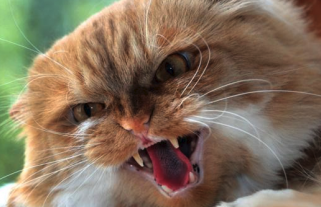
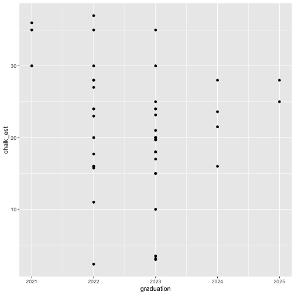
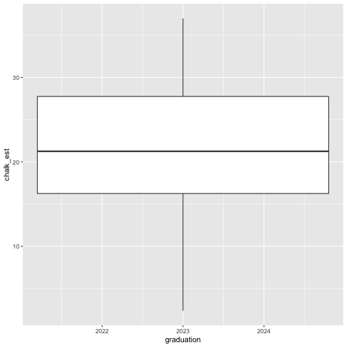
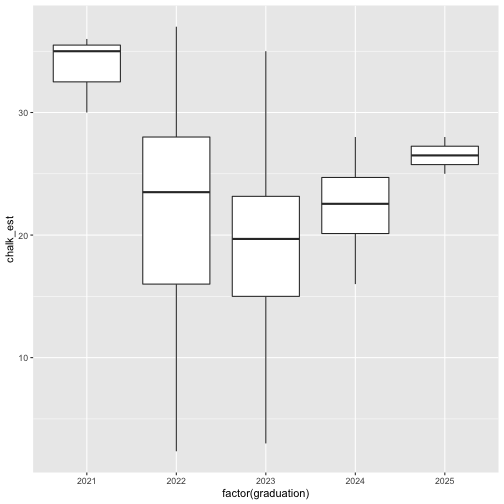

One-Way ANOVA
========================================================
author: Prof Randi Garcia
date: September 7, 2021
autosize: true
transition: linear
transition-speed: default
font-family: 'Helvetica'

<style>
.small-code pre code {
  font-size: 1em;
}
</style>

Announcements
========================================================

- Slack issues?
- Registration issues?
- Homework 1c
- In-person Office hours (Bass 412)
    - Wed 10:50-12:05p
    - Thurs 1:20-2:35p
- Zoom Office hours
    - Book a 15-min time slot [here](https://randigarcia.youcanbook.me/)

Why Model?
========================================================
1. Making Predictions
2. Understanding Relationships
3. Assessing Differences

Why Model?
========================================================
1. Making Predictions
2. Understanding Relationships
3. **Assessing Differences**

4 Step Process
========================================================

1. *Choose* the model: What type of model?
2. *Fit* the model to the data
3. *Assess* the model: Is the model adequate? Could it be simpler? Are assumptions met?
4. *Use*: Answer the question of interest

4 Step Process
========================================================

1. *Choose* the model: What type of model?
    - We design the experiment and collect the data to match the model.
2. *Fit* the model to the data
3. *Assess* the model: Is the model adequate? Could it be simpler? Are assumptions met?
4. *Use*: Answer the question of interest

Our First Experiment
========================================================


***




Our First Experiment
========================================================


***


Our First Experiment
========================================================

- What were all of the possibilities? How do you think that was determined?
- Which conditions were distributed *across* people, and which *within* people?
- What do you think are the possible research questions answered by this study?
        
        
What made this study an "Experiment"?
========================================================
incremental: true
- Can you assign experimental material to conditions?
- You've created those conditions
- If the material alredy comes in different "varieties", then it's an *observational* study
    - People with different psychiatric illnesses
    - Different species of plants
- Sometimes one "study" will have both **experimental** and **observational** explanatory variables.

Defining Terms
=======================================================
- **Balanced Designs**: all conditions (or *treatments*) have the same number of observations.
    - Unbalanced design do not.
- **Experimental Units**: the element that gets randomized to conditions. We record one score on our response variable per unit.
- **Factors** and **Levels**: The factor is the entire explanatory variable. Also called an **independent variable**. A factor's levels are the individual conditions (or *treatments*).
- **Response**: The outcome variable. Also called **dependent vairable**. We want to see if our factors have an effect on our response variable. 

Confounding Variables
=======================================================
I want to test if smelling a sweet food (fresh cinnamon rolls) versus a non-sweet food (broccoli) has an effect on salivation in humans. So, I recruit some participants to come to my lab, I'll have to bake the cinnamon rolls and run that condition all at once, so I decide that I will bake my rolls at 9a, then from 10a-12p I will run the cinnamon roll condition. I bring people into individual distraction free rooms, hook them up to the salivation sensor, then bring them a plate with a freshly baked cinnamon roll. I record their salivation. Then, I will run the broccoli condition from 1p-3p, using the same measurement procedure. 

Are there any confounding variables in my study?

Bias
=======================================================
Our data will be "off" in a systematic, non-random, way

- Sampling Bias: Biologist is using a net with large holes to capture a sample of fish from a lake. 
- Selection Bias: Assigning the skinnier rats to the good lab chow. 


One-Way ANOVA
=======================================================
class: small-code
- One factor (explanatory variable) with any number of levels.
- One quantitative (non-binary) response variable. 


```r
library(tidyverse)
library(readr)

survey <- read_csv("https://randilgarcia.github.io/sds290fall21/class_surveyData.csv")

survey %>%
  select(graduation, chalk_est) %>%
  head()
```

```
# A tibble: 6 x 2
  graduation chalk_est
       <dbl>     <dbl>
1       2022        16
2       2023        25
3       2023        17
4       2022        24
5       2023        30
6       2021        36
```

One-Way ANOVA
=======================================================
class: small-code

```r
qplot(x = graduation, y = chalk_est, data = survey)
```



One-Way ANOVA
=======================================================
class: small-code

```r
qplot(x = graduation, y = chalk_est, data = survey, geom = "boxplot")
```



One-Way ANOVA
=======================================================
class: small-code

```r
qplot(x = factor(graduation), y = chalk_est, data = survey, geom = "boxplot")
```



The Meats 
=======================================================
One-Way Design

The shelf life of meats is the time a prepackaged cut remains salable, safe, and nutritious. Recent studies suggested controlled gas atmospheres as possible alternatives to existing packaging. To test this, beef steaks (75$g$) were randomly assigned to packaging with either 1) ambient air in a  commercial plastic wrap, 2) vacuum packed, 3) 100% carbon dioxide ($CO_2$), or 4) a mixture of 1% carbon monoxide (CO), 40% oxygen ($O_2$), and 59% nitrogen (N). The number of psychrotrophic bacteria on the meat was measured after nine days of storage at 4 degrees C.

Gender Bias in STEM
=======================================================
One-Way Design 

In a randomized double-blind study (n = 127), science faculty from research-intensive universities rated the application materials of a student who was randomly assigned either a male or female name for a laboratory manager position. Faculty participants rated the male applicant as significantly more hireable than the (identical) female applicant. [See materials here](http://www.pnas.org/content/suppl/2012/09/16/1211286109.DCSupplemental/pnas.201211286SI.pdf#nameddest=STXT)

Acid Rain   
=======================================================
One-Way Design

"Clean" precipitation has a pH in the 5.0 to 5.5 range, but observed precipitation pH in northern New Hampshire is often in the 3.0 to 4.0 range. Is this acid rain hurting trees? 240 six-week-old yellow birch seedlings were randomly assigned to one of 5 groups. Each group received an acid rain mist at the following pH levels: 4.7, 4.0, 3.3, 3.0, and 2.3. After 17 weeks, the seedling were weighed, and their total plant (dry) weight was recorded. 

Leafhopper survival
=======================================================
One-Way Design

It is reasonable to assume that the structure of a sugar molecule has something to do with its food value.
An experiment was conducted to compare the effects of four sugar diets on the survival of leafhoppers. The four diets were glucose and fructose (6-carbon atoms), sucrose (12-carbon), and a control (2% agar). The experimenter prepared two dishes with each diet, divided the leafhoppers into eight groups of equal size, and then randomly assigned them to dishes. Then she counted the number of days until half the insects had died in each group.

<!-- Inappropriate Insects -->
<!-- ======================================================= -->
<!-- One-Way Complete Block Design CB[1]   -->

<!-- Modern zoos try to reproduce natural habitats in their exhibits as much as possible. They try to use appropriate plants, but these plants can be infested with inappropriate insects. Cycads (plants that look vaguely like palms) can be infected with mealybugs, and the zoo wishes to test three treatments: 1) water, 2) horticultural oil, and 3) fungal spores in water. Five infested cycads are taken to to the testing area. Three branches are randomly selected from each tree, and 3 cm by 3 cm patches are marked on each branch. The number of mealybugs on the patch is counted. The three treatments then get randomly assigned to the three branches for each tree. After three days the mealybugs are counted again. The change in number of mealybugs is computed ($before-after$). -->

<!-- Radioactive Twins -->
<!-- ======================================================= -->
<!-- One-Way Complete Block Design CB[1]   -->

<!-- Most people believe that country air is better to breather than city air, but how would you test it? You might start by choosing a response that narrows down what you mean by "better." One feature of healthy lungs is tracheobronchial clearance---how fast they get rid of nasty stuff. To test this idea, investigators found 7 sets of mono-zygotic twins where one was living in the country and one in the city. Each person inhaled an aerosol of radioactive Teflon particles. Then the level of radioactivity was measured once right after inhaling, and again an hour later. The percent of the original radioactivity remaining was calculated.  -->

<!-- Swimsuit/Sweater Study -->
<!-- ======================================================= -->
<!-- Two-Way Basic Factorial Design BF[2] -->

<!-- Objectification theory (Fredrickson & Roberts, 1997) posits that American culture socializes women to adopt observers' perspectives on their physical selves. This self-objectification is hypothesized to (a) produce body shame, which in turn leads to restrained eating, and (b) consume attentional resources, which is manifested in diminished mental performance. An experiment manipulated self-objectification by having participants try on a swimsuit or a sweater. Further, it tested 21 women and 20 men, in each condition, and found that these effects on body shame and restrained eating replicated for women only. Additionally, self-objectification diminished math performance for women only.  -->


<!-- Creepy Animals -->
<!-- ======================================================= -->
<!-- Split Plot/Repeated Measures Design SP/RM[2,1] -->

<!-- The effects of exposure to images of different domestic animal species in either aggressive or submissive postures on mood was tested with a split-plot/repeated measures design. Using a computer to randomize, participants were randomly assigned to either view images of dogs or images of cats. All participants saw both an aggressive animal and a submissive animal, and their moods were assessed via self-report after each image. The order of presentation (aggressive then submission, or submissive then aggressive) was randomized to control for order effects.  -->

<!-- What's Your Response? -->
<!-- ======================================================== -->
<!-- Categorical -->

<!-- - **nominal:** categorical variable whose levels have no ordering. -->
<!--     - gender, race, etc. -->
<!-- - **ordinal:** categorical variable whose levels have an order.  -->
<!--     - education level -->

<!-- What's Your Response? -->
<!-- ======================================================== -->
<!-- Quantitative -->

<!-- - **interval:** numerical variable where we assume the distance between points is equal. No true zero. -->
<!--     - scores on a “self-esteem” scale, measured from 1 to 7  -->
<!-- - **ratio:** numerical variable that has a true zero point.  -->
<!--     - students’ times to complete cognitive task -->
<!--     - enzyme concentration -->
    
Work on Homework 1c
========================================================

Get started [here](https://randilgarcia.github.io/sds290fall21/labs/intro_to_r.html)

