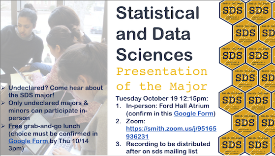

```{r setup, include=FALSE}
knitr::opts_chunk$set(message = FALSE, warning = FALSE)
library(tidyverse)
tree <- c(rep("tree1",3), rep("tree2",3), rep("tree3", 3),rep("tree4", 3), rep("tree5", 3))
treatment <- rep(c("water", "spores", "oil"), 5)
bugs_change <- c(-9, -4, 4, 18, 29, 29, 10, 4, 14, 9, -2, 14, -6, 11, 7)

mealybugs <- data.frame(tree, treatment, bugs_change)
```

## Announcements

- HW 5 due Friday 11:55p
- Office hours
    - Friday office hours 12:15p-3:00p 
        - Appointment slots are open!
- Where to get HW help
    - [Spinelli center](https://www.smith.edu/qlc/tutoring.html) tutoring Sun-Thurs 7-9p, Sabin-Reed 301.
    - Post questions to #homework5-questions channel on Slack!

- Applications open for DSC-WAV (more info [here](https://dsc-wav.github.io/www/students.html#Eligibility))

## Presentation of the SDS Major

- SDS Presentation of the Major **Tuesday 10/19 at 12:15pm**. There are three ways to participate:
    1. In-person in the Ford Hall Atrium: Only **undeclared majors/minors may attend in-person**. Advance sign-up is required in this [Google Form](https://docs.google.com/forms/d/e/1FAIpQLSel3YWGLxjvr-UBweuwBL_d3U8lb_4E0rLeCrAAVh-Jam8ibw/viewform). To guarantee your free grab-and-go lunch option, please confirm by Thursday 10/14 at 3pm. 
    2. Zoom: Anyone may attend at https://smith.zoom.us/j/95165936231 
    3. A recording of the presentation will be shared afterwards on this mailing list
    
    
    
## Agenda

1. MP1 data collection!
2. Complete Block design
  - Diagnostic plots
  - ANOVA


## MP1 data collection

**Step 1:** 

- If you're approved:
    - 15 minutes to go through the [checklist](https://randilgarcia.github.io/sds290fall21/lectures/10_complete_block.html#4).
    - Paste anonymous survey link in the [spreadsheet](https://docs.google.com/spreadsheets/d/1JHUJNT5cBdl5koxthakEIdgagAMpv7VV6zkELpNyz7E/edit#gid=0).
    - If you're ready, work on your homework!
- If you're **NOT** approved
    - Use this time to work on your revisions.

**Step 2:**

- 20 min to participate in as many studies as you can!
    - Note: see content warnings
    - Please only participate in audio studies if you have headphones
    - **We'll collect data again on Tuesday**.

## Inappropriate Insects

Modern zoos try to reproduce natural habitats in their exhibits as much as possible. They try to use appropriate plants, but these plants can be infested with inappropriate insects. Cycads (plants that look vaguely like palms) can be infected with mealybugs, and the zoo wishes to test three treatments: 1) water, 2) horticultural oil, and 3) fungal spores in water. Nine infested cycads are taken to the testing area. Three branches are randomly selected from each tree, and 3 cm by 3 cm patches are marked on each branch. The number of mealybugs on the patch is counted. The three treatments then get randomly assigned to the three branches for each tree. After three days the mealybugs are counted again. The change in number of mealybugs is computed ($before-after$).

## Side-by-side dotplot

We add our blocking factor as `color` and also as `group`. 

```{r}
qplot(x = treatment, y = bugs_change, color = tree, group = tree, data = mealybugs) + 
  geom_line()
```

We can see that Tree 2's infestation was very responsive to the treatments whereas Tree 1's was not.

<!-- ## Side-by-side dotplot (adjusted for effect of blocks) -->

<!-- ```{r, include=FALSE} -->
<!-- mealybugs <- mealybugs %>% -->
<!--   ungroup() %>% -->
<!--   mutate(grand = mean(bugs_change)) %>% -->
<!--   group_by(tree) %>% -->
<!--   mutate(tree_mean = mean(bugs_change), -->
<!--          tree_effect = tree_mean - grand, -->
<!--          bugs_change_adj = bugs_change - tree_effect) %>% -->
<!--   ungroup() %>% -->
<!--   group_by(treatment) %>% -->
<!--   mutate(treatment_effect = mean(bugs_change)) -->
<!-- ``` -->

<!-- ```{r} -->
<!-- qplot(x = treatment, bugs_change_adj, data = mealybugs) -->
<!-- ``` -->

## Formal ANOVA for Complete Block Design

$${y}_{ij}={\mu}+{\tau}_{i}+{\beta}_{j}+{e}_{ij}$$

| Source | SS | df | MS | F |
|------:|:-----:|:-----:|:------:|:------:|
| Treatment | $\sum_{i=1}^{a}b(\bar{y}_{i.}-\bar{y}_{..})^{2}$ | $a-1$ | $\frac{{SS}_{T}}{{df}_{T}}$ | $\frac{{MS}_{T}}{{MS}_{E}}$ |
| Blocks | $\sum_{j=1}^{b}a(\bar{y}_{.j}-\bar{y}_{..})^{2}$ | $b-1$ | $\frac{{SS}_{B}}{{df}_{B}}$ | $\frac{{MS}_{B}}{{MS}_{E}}$ |
| Error | $\sum_{i=1}^{a}\sum_{j=1}^{b}({y}_{ij}-\bar{y}_{i.}-\bar{y}_{.j}+\bar{y}_{..})^{2}$ | $(a-1)(b-1)$ | $\frac{{SS}_{E}}{{df}_{E}}$ | |

## Data Analysis Structure

```{r, include=FALSE}
rm(mealybugs)
tree <- c(rep("tree1",3), rep("tree2",3), rep("tree3", 3),rep("tree4", 3), rep("tree5", 3))
treatment <- rep(c("water", "spores", "oil"), 5)
bugs_change <- c(-9, -4, 4, 18, 29, 29, 10, 4, 14, 9, -2, 14, -6, 11, 7)
mealybugs <- data.frame(tree, treatment, bugs_change)
```

```{r}
mealybugs
```

## Formal ANOVA

```{r}
mod <- lm(bugs_change ~ treatment + tree, data = mealybugs)

anova(mod)
```

There are no statistically significant differences in the reduction in mealy bugs between the three treatment conditions, $F(2, 8) = 3.00$, $p = .107$. There are significant differences in the reduction in mealy bugs across trees, however, $F(4, 8) = 9.04$, $p = .005$. That is, some trees improved more than other trees. 

## Informal Analysis Structure

```{r}
mealybugs_wide <- mealybugs %>%
  pivot_wider(names_from = treatment, values_from = bugs_change)

mealybugs_wide
```

## How to check assumptions

- C. **Constant effects** -- *think* about whether it is reasonable.

- A. **Additive effects** -- check Anscombe block plots.

- S. **Same standard deviations** -- is the biggest SD less than two times as large as the smallest? check residual versus fitted plot: *does the plot thicken*?

- I. **Independent residuals** -- *think* about whether it is reasonable.

- N. **Normally distributed residuals** -- construct a histogram or normal probability plot of residuals.

- Z. **Zero mean residuals** -- construct a histogram or normal probability plot of residuals.

## Anscombe Block Plots

- Scatterplots of two levels of the factor of interest.
- Used for 
    - exploring the data, and 
    - assessing the **additivity (A)** condition. 

## Informal Analysis Structure

```{r}
mealybugs_wide <- mealybugs %>%
  pivot_wider(names_from = treatment, values_from = bugs_change)

mealybugs_wide
```

## Anscombe Block Plots

```{r}
qplot(x = spores, y = oil, data = mealybugs_wide) +
  geom_abline(intercept = 13.6-7.6, slope = 1, color = "blue", linetype = 2) + 
  geom_smooth(method = "lm", se = 0, color = "orange")
```

## Anscombe Block Plots

```{r}
qplot(x = spores, y = water, data = mealybugs_wide) +
  geom_abline(intercept = 4.4 - 13.6, slope = 1, color = "blue", linetype = 2) + 
  geom_smooth(method = "lm", se = 0, color = "orange")
```

## Anscombe Block Plots

```{r}
qplot(x = oil, y = water, data = mealybugs_wide) +
  geom_abline(intercept = 4.4 - 13.6, slope = 1, color = "blue", linetype = 2) + 
  geom_smooth(method = "lm", se = 0, color = "orange")
```

## Assessing S Condition

```{r}
mealybugs %>%
  group_by(treatment) %>%
  summarize(m = mean(bugs_change),
            sd = sd(bugs_change))

mealybugs %>%
  group_by(treatment) %>%
  summarize(m = mean(bugs_change),
            sd = sd(bugs_change)) %>%
  summarize(max(sd)/min(sd)) #calculating using min and max function
```

## Assessing S Condition

$$\hat{{y}}_{ij}={\mu}+{\tau}_{i}+{\beta}_{j}$$

- Where $\hat{{y}}_{ij}$ are the **fitted values**, that is, everything but the ticket at the end of the assembly line. 

```{r}
plot(mod, which = 1)
```

If the **plot thickens**, that is, has a patterning that looks like a funnel, then the S condition is not satisfied. 

## Assessing N Condition

```{r}
plot(mod, which = 2)
```

We're looking for residuals to be on the line. If so, then we can say they are normally distributed.  

## Assessing the Z Condition

```{r}
qplot(mod$residuals, bins = 6)
```

If the histogram centered at zero? Then the Z condition is satisfied. 

## Sleeping Shrews

Assess the CA-SINZ conditions for the `SleepingShrews` dataset from example 6.7b in your textbook. 

```{r}
library(Stat2Data)
data("SleepingShrews")

#You'll need the WIDE dataset for the Anscombe block plots
SleepingShrews_wide <- SleepingShrews %>%
  select(-ID) %>%
  pivot_wider(names_from = Phase, values_from = Rate)
```

## Testing Condition for Sleeping Shrews Data

```{r, eval = FALSE}
qplot(x = DSW, y = LSW, data = SleepingShrews_wide) +
  geom_abline(intercept = 2, slope = 1, color = "blue", linetype = 2) +   
  geom_smooth(method = "lm", se = 0, color = "orange") #A condition

qplot(x = DSW, y = REM, data = SleepingShrews_wide) +
  geom_abline(intercept = 2, slope = 1, color = "blue", linetype = 2) +   
  geom_smooth(method = "lm", se = 0, color = "orange") #A condition

qplot(x = LSW, y = REM, data = SleepingShrews_wide) +
  geom_abline(intercept = -2, slope = 1, color = "blue", linetype = 2) +   
  geom_smooth(method = "lm", se = 0, color = "orange") #A condition

SleepingShrews %>%
  group_by(Phase) %>%
  summarize(m = mean(Rate),
            sd = sd(Rate)) %>%
  summarize(max(sd)/min(sd)) #S condition

mod <- lm(Rate ~ Phase + Shrew, data = SleepingShrews)
plot(mod, which = 1) #S condition
plot(mod, which = 2) #N condition
qplot(mod$residuals, bins = 6) #N and Z conditions
```

