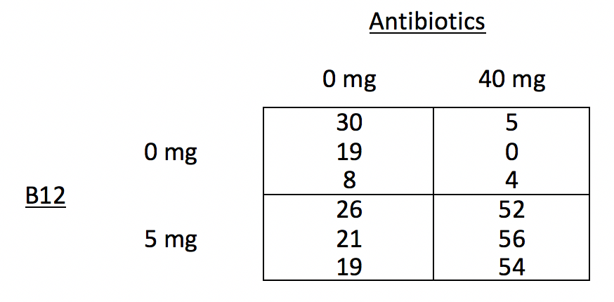

```{r setup, include=FALSE}
knitr::opts_chunk$set(echo = TRUE)
library(tidyverse)
library(Stat2Data)
```


## Announcements

- Expect Exam 1 grade next week
- Mini-Project 1 due tomorrow 11:55p on Moodle
- Office hours
    - Friday office hours 12:15p-3:00p (slots open!)
- Where to get MP1 help
    - Post questions to #mini-project1 channel on Slack!
    - Direct message me on Slack.
    
## Agenda

3. Review blocking
    a. Assessing conditions in block designs
4. Two-Way Factorial Design


## How to check assumptions for Complete Block Design

- C. **Constant effects** -- *think* about whether it is reasonable.

- A. **Additive effects** -- check Anscombe block plots.

- S. **Same standard deviations** -- is the biggest SD less than two times as large as the smallest? check residual versus fitted plot: *does the plot thicken*?

- I. **Independent residuals** -- *think* about whether it is reasonable.

- N. **Normally distributed residuals** -- construct a histogram or normal probability plot of residuals.

- Z. **Zero mean residuals** -- construct a histogram or normal probability plot of residuals.

## How to check assumptions for Complete Block Design

- C. **Constant effects** -- *think* about whether it is reasonable.

- A. **Additive effects** -- check **Anscombe block plots**.

- S. **Same standard deviations** -- is the biggest SD less than two times as large as the smallest? check **residual versus fitted** plot: *does the plot thicken*?

- I. **Independent residuals** -- *think* about whether it is reasonable.

- N. **Normally distributed residuals** -- construct a histogram or normal probability plot of residuals.

- Z. **Zero mean residuals** -- construct a histogram or normal probability plot of residuals.

## Anscombe Block Plots

- Scatterplots of two levels of the factor of interest.
- Used for 
    - exploring the data, and 
    - assessing the **additivity (A)** condition. 

## Informal Analysis Structure

```{r, include=FALSE}
rm(mealybugs)
tree <- c(rep("tree1",3), rep("tree2",3), rep("tree3", 3),rep("tree4", 3), rep("tree5", 3))
treatment <- rep(c("water", "spores", "oil"), 5)
bugs_change <- c(-9, -4, 4, 18, 29, 29, 10, 4, 14, 9, -2, 14, -6, 11, 7)
mealybugs <- data.frame(tree, treatment, bugs_change)
```

```{r}
mealybugs_wide <- mealybugs %>%
  pivot_wider(names_from = treatment, values_from = bugs_change)

mealybugs_wide
```

## Anscombe Block Plots

```{r, message=FALSE, warning=FALSE}
qplot(x = spores, y = oil, data = mealybugs_wide) +
  geom_abline(intercept = 13.6-7.6, slope = 1, color = "blue", linetype = 2) + 
  geom_smooth(method = "lm", se = 0, color = "orange")
```

## Anscombe Block Plots

```{r, message=FALSE, warning=FALSE}
qplot(x = spores, y = water, data = mealybugs_wide) +
  geom_abline(intercept = 4.4 - 13.6, slope = 1, color = "blue", linetype = 2) + 
  geom_smooth(method = "lm", se = 0, color = "orange")
```

## Anscombe Block Plots

```{r, message=FALSE, warning=FALSE}
qplot(x = oil, y = water, data = mealybugs_wide) +
  geom_abline(intercept = 4.4 - 13.6, slope = 1, color = "blue", linetype = 2) + 
  geom_smooth(method = "lm", se = 0, color = "orange")
```

## Assessing S Condition

```{r}
mealybugs %>%
  group_by(treatment) %>%
  summarize(m = mean(bugs_change),
            sd = sd(bugs_change))

mealybugs %>%
  group_by(treatment) %>%
  summarize(m = mean(bugs_change),
            sd = sd(bugs_change)) %>%
  summarize(max(sd)/min(sd)) #calculating using min and max function
```

## Assessing S Condition

Residual versus fitted plot

- Looking for no apparent pattern. 
- Constant variance across fitted values. 

```{r, eval = FALSE}
mod <- lm(bugs_change ~ treatment + tree, data = mealybugs)

plot(mod, which = 1)
```

## Assessing S Condition

```{r}
mod <- lm(bugs_change ~ treatment + tree, data = mealybugs)

plot(mod, which = 1)
```

## SleepingShrews: Anscombe Block Plots 

```{r}
library(Stat2Data)
data("SleepingShrews")
```

- Fit the two-way additive model for the `SleepingShrews` data. (See homework 5)
- Construct Anscombe Block Plots to assess the additivity condition 

```{r, eval=FALSE}
SleepingShrews_wide <- SleepingShrews %>%
  select(-ID) %>%
  pivot_wider(names_from = Phase, values_from = Rate)
```

## SleepingShrews: Anscombe Block Plots 

```{r, include=FALSE}
SleepingShrews_wide <- SleepingShrews %>%
  select(-ID) %>%
  pivot_wider(names_from = Phase, values_from = Rate)
```

To get your intercepts, calculate the treatment effects. 

```{r}
SleepingShrews <- SleepingShrews %>%
  mutate(grandmean = mean(Rate)) %>%
  group_by(Phase) %>%
  mutate(phase_mean = mean(Rate),
         phase_eff = phase_mean - grandmean)
```

```{r}
SleepingShrews %>%
  group_by(Phase) %>%
  summarise(phase_eff = mean(phase_eff))
```

## SleepingShrews: Anscombe Block Plots 

Intercept is `y_eff - x_eff`:

```{r, message=FALSE, warning=FALSE}
qplot(x = LSW, y = DSW, data = SleepingShrews_wide) +
  geom_abline(intercept = (-0.6)-1.3, slope = 1, color = "blue", linetype = 2) + 
  geom_smooth(method = "lm", se = 0, color = "orange")
```

## SleepingShrews: Anscombe Block Plots 

```{r, message=FALSE, warning=FALSE}
qplot(x = REM, y = DSW, data = SleepingShrews_wide) +
  geom_abline(intercept = (-0.6)-(-0.7), slope = 1, color = "blue", linetype = 2) + 
  geom_smooth(method = "lm", se = 0, color = "orange")
```

## SleepingShrews: Anscombe Block Plots 

```{r, message=FALSE, warning=FALSE}
qplot(x = REM, y = LSW, data = SleepingShrews_wide) +
  geom_abline(intercept = (1.3)-(-0.7), slope = 1, color = "blue", linetype = 2) + 
  geom_smooth(method = "lm", se = 0, color = "orange")
```

## Paper Helicopters

[Paper helicopters](https://williamghunter.net/images/teaching-engineers-experimental-design-with-a-paper-helicopter/teaching-engineers-experimental-design-with-a-paper-helicopter-image1.png) can be cut from one half of an 8.5 by 11 sheet of paper. We can conduct an experiment by dropping helicopters from a fixed height and clocking the time it takes to drop. We can vary wing length: 4.25 in, 4.0 in, 3.75 in, and 3.5 in, as well as body width: 3.25 in, 3.75 in, 4.0 in, and 4.25 in. We'll make 32 planes and randomly assign them to the 16 combinations. 

## Parks and Recreation

Deputy director of the Pawnee Parks and Rec department, Leslie Knope, needs to know how resistant different vegetative types are to trampling so that the number of visitors can be controlled in sensitive areas. Twenty lanes of a park are established, each .5 m wide and 1.5 m long. These twenty lanes are randomly assigned to five treatments: 0, 25, 75, 200, or 500 walking passes. Each pass consists of a 70-kg individual wearing boots, walking in a natural gait. One year after trampling, the average height of the vegetation along the lanes are measured. 

## Design Name Disambiguation

**One-Way Design**

- If the factor is a true experimental factor
    - One-Way **Randomized** Design or 
    
**Block design** or **Two-Way Additive Model**

- If the factor of interest is experimental
    - **Randomized** Block Design
- If every block gets every treatment
    - **Complete** Block Design    

## Design Name Disambiguation

**Two-Way Factorial Design**

- If the factor of interest is experimental
    - **Randomized** Two-Way Factorial
    
- There is no blocking in this design    

## Piglets

It seems natural to think that adding the right vitamins to a pig's diet might produce fatter pigs faster. You've decided to study the effects of B12 in two doses (0mg and 5mg).  But pigs have bacteria living in their intestines that might prevent the uptake of vitamins, so you decided to give antibiotics to the pigs in one of two doses (0mg or 40 mg). You design your experiment in such a way that 3 piglets are randomly assigned to each of the 4 treatment conditions. You measure their weight every day, and take each pig's average daily weight gain as your final number recorded. 
    
    
## Two-Way Factorial Design Factor Diagram



- Draw the factor diagram

## Research Questions in a Two-Way Factorial Design

1. Does treatment A have an effect on the response variable?
    - Is there a main effect of factor A?
2. Does treatment B have an effect on the response variable?
    - Is there a main effect of factor B?
3. Does being in a specific combination of treatments have an effect over and above the additive effects of treatment A and B alone?
    - Is there an interaction between factor A and factor B?


## Two-Way Factorial Design Formulas

$${y}_{ijk}={\mu}+{\alpha}_{i}+{\beta}_{j}+{\alpha\beta}_{ij}+{e}_{ijk}$$

- Where $i$, from 1 to $a$, is the level of the first factor,
- $j$, from 1 to $b$, is the level of the second factor, 
- and $k$, from 1 to $n$, is the observation in each cell. 

## Sum of Squares (SS)

$${SS}_{A} = \sum_{i=1}^{a}bn(\bar{y}_{i..}-\bar{y}_{…})^{2}$$

$${SS}_{B} = \sum_{j=1}^{b}an(\bar{y}_{.j.}-\bar{y}_{…})^{2}$$

$${SS}_{AB} = n\sum_{i=1}^{a}\sum_{j=1}^{b}(\bar{y}_{ij.}-\bar{y}_{i..}-\bar{y}_{.j.}+\bar{y}_{…})^{2}$$

$${SS}_{E} = \sum_{i=1}^{a}\sum_{j=1}^{b}\sum_{k=1}^{n}({y}_{ijk}-\bar{y}_{ij.})^{2}$$


## Degrees of Freedom (df)

$${df}_{A}=a-1$$

$${df}_{B}=b-1$$

$${df}_{AB}=(a-1)(b-1)$$

$${df}_{E}=ab(n-1)$$

## Mean Squares (MS) 

$${MS}_{A}=\frac{{SS}_{A}}{{df}_{A}}$$

$${MS}_{B}=\frac{{SS}_{B}}{{df}_{B}}$$

$${MS}_{AB}=\frac{{SS}_{AB}}{{df}_{AB}}$$

$${MS}_{E}=\frac{{SS}_{E}}{{df}_{E}}$$


## F-ratios and the F-distribution

The ultimate statistics we want to calculate is Variability in treatment effects/Variability in residuals. The F-ratio.

$$F = \frac{{MS}_{A}}{{MS}_{E}}$$

$$F = \frac{{MS}_{B}}{{MS}_{E}}$$

$$F = \frac{{MS}_{AB}}{{MS}_{E}}$$


## ANOVA Source Table for Two-Way Factorial

$${y}_{ijk}={\mu}+{\alpha}_{i}+{\beta}_{j}+{\alpha\beta}_{ij}+{e}_{ijk}$$

| Source | SS | df | MS | F |
|------:|:-----:|:-----:|:------:|:------:|
| Treatment A | $\sum_{i=1}^{a}bn(\bar{y}_{i..}-\bar{y}_{…})^{2}$ | $a-1$ | $\frac{{SS}_{A}}{{df}_{A}}$ | $\frac{{MS}_{A}}{{MS}_{E}}$ |
| Treatment B | $\sum_{j=1}^{b}an(\bar{y}_{.j.}-\bar{y}_{…})^{2}$ | $b-1$ | $\frac{{SS}_{B}}{{df}_{B}}$ | $\frac{{MS}_{B}}{{MS}_{E}}$ |
| Interaction AB | $n\sum_{i=1}^{a}\sum_{j=1}^{b}(\bar{y}_{ij.}-\bar{y}_{i..}-\bar{y}_{.j.}+\bar{y}_{…})^{2}$ | $(a-1)(b-1)$ | $\frac{{SS}_{AB}}{{df}_{AB}}$ | $\frac{{MS}_{AB}}{{MS}_{E}}$ |
| Error | $\sum_{i=1}^{a}\sum_{j=1}^{b}\sum_{k=1}^{n}({y}_{ijk}-\bar{y}_{ij.})^{2}$ | $ab(n-1)$ | $\frac{{SS}_{E}}{{df}_{E}}$ | |

## Interaction Graphs

For each of the following interaction graphs, answer the following questions with **YES** or **NO**.

1. Is there a main effect of B12?
2. Is there a main effect of antibiotics?
3. Is there an interaction between B12 and antibiotics?

## Practice 1

```{r, echo = FALSE, warning=FALSE, message=FALSE}
library(dplyr)
library(ggplot2)
piglets <- data.frame(gain = c(4, 4, 4, 
                               5, 5, 5,
                               6, 6, 6,
                               7, 7, 7), 
                      group = as.factor(c(rep(1, 3), rep(2, 3), rep(3, 3), rep(4, 3))), 
                      antibiotic = c(rep("0mg", 3), rep("40mg", 3), rep("0mg", 3), rep("40mg", 3)),
                      B12 = c(rep("0mg", 6), rep("5mg", 6)))

ggplot(piglets, aes(x = B12, y = gain, 
                    group = antibiotic, 
                    linetype = antibiotic, 
                    shape = antibiotic,
                    color = antibiotic)) +
  geom_point() +
  geom_smooth(method = "lm", se = 0) +
  ylim(2, 9)
```

## Practice 1

```{r, echo = FALSE, warning=FALSE, message=FALSE}
library(dplyr)
library(ggplot2)
piglets <- data.frame(gain = c(4, 4, 4, 
                               5, 5, 5,
                               6, 6, 6,
                               7, 7, 7), 
                      group = as.factor(c(rep(1, 3), rep(2, 3), rep(3, 3), rep(4, 3))), 
                      antibiotic = c(rep("0mg", 3), rep("40mg", 3), rep("0mg", 3), rep("40mg", 3)),
                      B12 = c(rep("0mg", 6), rep("5mg", 6)))

ggplot(piglets, aes(x = B12, y = gain, 
                    group = antibiotic, 
                    linetype = antibiotic, 
                    shape = antibiotic,
                    color = antibiotic)) +
  geom_point() +
  geom_smooth(method = "lm", se = 0) +
  ylim(2, 9)
```

***

1. YES
2. YES
3. NO

## Practice 2

```{r, echo = FALSE, warning=FALSE, message=FALSE}
library(dplyr)
library(ggplot2)
piglets <- data.frame(gain = c(4, 4, 4, 
                               7, 7, 7,
                               4, 4, 4,
                               7, 7, 7), 
                      group = as.factor(c(rep(1, 3), rep(2, 3), rep(3, 3), rep(4, 3))), 
                      antibiotic = c(rep("0mg", 3), rep("40mg", 3), rep("0mg", 3), rep("40mg", 3)),
                      B12 = c(rep("0mg", 6), rep("5mg", 6)))

ggplot(piglets, aes(x = B12, y = gain, 
                    group = antibiotic, 
                    linetype = antibiotic, 
                    shape = antibiotic,
                    color = antibiotic)) +
  geom_point() +
  geom_smooth(method = "lm", se = 0) +
  ylim(2, 9)
```

## Practice 2

```{r, echo = FALSE, warning=FALSE, message=FALSE}
library(dplyr)
library(ggplot2)
piglets <- data.frame(gain = c(4, 4, 4, 
                               7, 7, 7,
                               4, 4, 4,
                               7, 7, 7), 
                      group = as.factor(c(rep(1, 3), rep(2, 3), rep(3, 3), rep(4, 3))), 
                      antibiotic = c(rep("0mg", 3), rep("40mg", 3), rep("0mg", 3), rep("40mg", 3)),
                      B12 = c(rep("0mg", 6), rep("5mg", 6)))

ggplot(piglets, aes(x = B12, y = gain, 
                    group = antibiotic, 
                    linetype = antibiotic, 
                    shape = antibiotic,
                    color = antibiotic)) +
  geom_point() +
  geom_smooth(method = "lm", se = 0) +
  ylim(2, 9)
```

***

1. NO
2. YES
3. NO

## Two-Way Factorial in R

[See Two-Way Factorial code](https://randilgarcia.github.io/sds290fall21/lectures/09_two-way_fac_inR.Rmd)

<!-- ## Teaching Methods -->

<!-- A professor wanted to compare three different teaching methods to determine how students  -->
<!-- would perceive the course: 1) instructionist, 2) inquiry-based, and 3) team-based. She randomly assigned the same class (same topic different students) from 6 different semesters to treatments. At the end of the semester students were asked to rate the course on a 5-point scale, and the average class rating was calculated.  -->

<!-- ## Anxiety and Memory -->

<!-- A psychologist wants to study the effect of anxiety on 4 different types of memory. Twelve participants are assigned to one of two anxiety conditions: 1) low anxiety group is told that they will be awarded \$5 for participation and \$10 if they remember sufficiently accurately, and 2) high anxiety group is told they will be awarded \$5 for participation and \$100 if they remember sufficiently accurately. All subjects perform four memory trials in random order, testing 4 different types of memory. The number of errors on each trial is recorded.      -->

