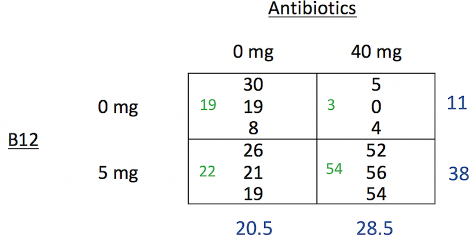

```{r setup, include=FALSE}
knitr::opts_chunk$set(echo = TRUE)
library(tidyverse)
library(Stat2Data)
```


## Announcements

- MP1 grades are posted
- HW 7 posted and due tomorrow Nov 12 11:55p
    - Find a research article that uses ANOVA!
- Zoom Office hours
    - Friday 2:00-**4p**
    - Slots are open
- Where to get HW help
    - [Spinelli center](https://www.smith.edu/qlc/tutoring.html) tutoring Sun-Thurs 7-9p, Sabin-Reed 301.
    - Post questions to #homework7-questions channel on Slack!
    - Direct message me on Slack.
- SDS Graduate School Panel**Nov 22 7-8p via Zoom** 
    - See Moodle for more details. 
    
## SDS Biostatistics Job Candidate - Friday

**Kaitlyn Cook tomorrow!!**

1. Tea with candidates 3:30-4:30 p.m. (all set for students for this one!)
2. Research talk with grab-and-go lunch (**12:25-1:20 p.m., Ford 240**)
    - "Statistical Methods for Cluster-Randomized Infectious Disease Prevention Trial"
3. Teaching demonstration (**5:00-6:00 p.m., Sabin-Reed 301**)
    - "Introduction to Logistic Regression"
    
## SDS Biostatistics Job Candidate - Monday

**Anny-Claude Joseph on Monday!!**

1. Tea with candidates 3:30-4:30 p.m. (all set for students for this one too!)
2. Research talk with grab-and-go lunch (**12:25-1:20 p.m., Ford 240**)
    - "The Timing of Geographic Power"
3. Teaching demonstration (**5:00-6:00 p.m., Sabin-Reed 301**)
    
## Agenda

1. Fitting the Two-Way Factorial ANOVA model
    - Degrees of freedom
2. Conditions for the Two-Way Factorial ANOVA  
3. Confidence intervals and effect sizes 
4. MP2 [project groups!](https://docs.google.com/spreadsheets/d/1m5vEHBL0QUkYxiDhbLxQQd0RzIHBFlq9Sg16akAquXk/edit?usp=sharing)
  
## Warm-up: Teaching Methods

A professor wanted to compare three different teaching methods to determine how students
would perceive the course: 1) instructionist, 2) inquiry-based, and 3) team-based. She randomly assigned the same class (same topic different students) from 6 different semesters to treatments. At the end of the semester students were asked to rate the course on a 5-point scale, and the average class rating was calculated.

## Warm-up: Swimsuit/Sweater Study

Objectification theory (Fredrickson & Roberts, 1997) posits that American culture socializes women to adopt observers' perspectives on their physical selves. This self-objectification is hypothesized to (a) produce body shame, which in turn leads to restrained eating, and (b) consume attentional resources, which is manifested in diminished mental performance on a math test. An experiment manipulated self-objectification by having participants try on a swimsuit or a sweater. Further, it tested 20 women and 20 men, in each condition, and found that the effects on math performance were present for women only. 

## Warm-up: Anxiety and Memory

A psychologist wants to study the effect of anxiety on 4 different types of memory. Twelve participants are assigned to one of two anxiety conditions: 1) low anxiety group is told that they will be awarded \$5 for participation and \$10 if they remember sufficiently accurately, and 2) high anxiety group is told they will be awarded \$5 for participation and \$100 if they remember sufficiently accurately. All subjects perform four memory trials in random order, testing 4 different types of memory. The number of errors on each trial is recorded.
  
## ANOVA Source Table for Two-Way Factorial

$${y}_{ijk}={\mu}+{\alpha}_{i}+{\beta}_{j}+{\alpha\beta}_{ij}+{e}_{ijk}$$

| Source | SS | df | MS | F |
|------:|:-----:|:-----:|:------:|:------:|
| Treatment A | $\sum_{i=1}^{a}bn(\bar{y}_{i..}-\bar{y}_{…})^{2}$ | $a-1$ | $\frac{{SS}_{A}}{{df}_{A}}$ | $\frac{{MS}_{A}}{{MS}_{E}}$ |
| Treatment B | $\sum_{j=1}^{b}an(\bar{y}_{.j.}-\bar{y}_{…})^{2}$ | $b-1$ | $\frac{{SS}_{B}}{{df}_{B}}$ | $\frac{{MS}_{B}}{{MS}_{E}}$ |
| Interaction AB | $n\sum_{i=1}^{a}\sum_{j=1}^{b}(\bar{y}_{ij.}-\bar{y}_{i..}-\bar{y}_{.j.}+\bar{y}_{…})^{2}$ | $(a-1)(b-1)$ | $\frac{{SS}_{AB}}{{df}_{AB}}$ | $\frac{{MS}_{AB}}{{MS}_{E}}$ |
| Error | $\sum_{i=1}^{a}\sum_{j=1}^{b}\sum_{k=1}^{n}({y}_{ijk}-\bar{y}_{ij.})^{2}$ | $ab(n-1)$ | $\frac{{SS}_{E}}{{df}_{E}}$ | |  
   
## Degrees of Freedom (df)

$${df}_{A}=a-1$$

$${df}_{B}=b-1$$

$${df}_{AB}=(a-1)(b-1)$$

$${df}_{E}=ab(n-1)$$

## Mean Squares (MS) 

$${MS}_{A}=\frac{{SS}_{A}}{{df}_{A}}$$

$${MS}_{B}=\frac{{SS}_{B}}{{df}_{B}}$$

$${MS}_{AB}=\frac{{SS}_{AB}}{{df}_{AB}}$$

$${MS}_{E}=\frac{{SS}_{E}}{{df}_{E}}$$

## Three Research Questions, Three F-ratios

1. Is there a significant main effect of factor A?
2. Is there a significant main effect of factor B?
3. Is there an significant interaction between factor A and factor B?

## F-ratios and the F-distribution

The ultimate statistics we want to calculate is Variability in treatment effects/Variability in residuals. The F-ratio.

$$F = \frac{{MS}_{A}}{{MS}_{E}}$$

$$F = \frac{{MS}_{B}}{{MS}_{E}}$$

$$F = \frac{{MS}_{AB}}{{MS}_{E}}$$


## ANOVA Source Table for Two-Way Factorial

$${y}_{ijk}={\mu}+{\alpha}_{i}+{\beta}_{j}+{\alpha\beta}_{ij}+{e}_{ijk}$$

| Source | SS | df | MS | F |
|------:|:-----:|:-----:|:------:|:------:|
| Treatment A | $\sum_{i=1}^{a}bn(\bar{y}_{i..}-\bar{y}_{…})^{2}$ | $a-1$ | $\frac{{SS}_{A}}{{df}_{A}}$ | $\frac{{MS}_{A}}{{MS}_{E}}$ |
| Treatment B | $\sum_{j=1}^{b}an(\bar{y}_{.j.}-\bar{y}_{…})^{2}$ | $b-1$ | $\frac{{SS}_{B}}{{df}_{B}}$ | $\frac{{MS}_{B}}{{MS}_{E}}$ |
| Interaction AB | $n\sum_{i=1}^{a}\sum_{j=1}^{b}(\bar{y}_{ij.}-\bar{y}_{i..}-\bar{y}_{.j.}+\bar{y}_{…})^{2}$ | $(a-1)(b-1)$ | $\frac{{SS}_{AB}}{{df}_{AB}}$ | $\frac{{MS}_{AB}}{{MS}_{E}}$ |
| Error | $\sum_{i=1}^{a}\sum_{j=1}^{b}\sum_{k=1}^{n}({y}_{ijk}-\bar{y}_{ij.})^{2}$ | $ab(n-1)$ | $\frac{{SS}_{E}}{{df}_{E}}$ | |

## Confidence intervals and effect sizes

- If the **interaction is significant** 
    - Calculate CIs and effect sizes for sets of *conditional averages* (also called "simple effects")
    - For example, for the 0mg antibiotics condition, what's the effect size for B12
- If the **interaction is NOT significant**
    - Calculate CIs and effect sizes for sets of *marginal averages* (also called "main effects")
    - For example, what is the effect size for B12 overall? 

## Conditional Averages and Marginal Averages



- The numbers in blue are *Marginal Averages*
- The numbers in green are *Conditional Averages*

## Confidence Intervals and Effect Sizes

### Confidence Intervals 

$$(\bar{y_i}-\bar{y_j}) \pm t^*\cdot SD \sqrt{1/n_i+1/n_j}$$

### Effect size

$$D_{ij} = \frac{(\bar{y_i}-\bar{y_j})}{SD}$$

- Where $SD = \sqrt{MSE}$

## Two-Way Factorial in R

[See Two-Way Factorial code](https://randilgarcia.github.io/sds290fall21/lectures/09_two-way_fac_inR.Rmd)

## MP2 Groups

- I have now assigned [MP2 groups](https://docs.google.com/spreadsheets/d/1m5vEHBL0QUkYxiDhbLxQQd0RzIHBFlq9Sg16akAquXk/edit?usp=sharing)
    - Please let me know in a private direct message on Slack if for any reason you would like to be re-assigned
- Time to discuss your MP1 projects and start brainstorming!    

